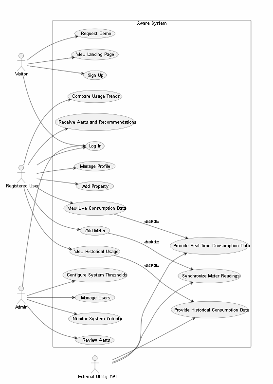

# Aware — Software Architecture Document

**Project:** Aware — Utility Consumption Monitoring Platform
**Version:** 1.0
**Date:** March 2026
**Status:** Draft

---

## Change History

| Version | Date | Author | Description |
|---------|------|--------|-------------|
| 0.1 | 2026-03-01 | Aware Team | Initial draft |
| 1.0 | 2026-03-23 | Aware Team | First complete version |

---

## Table of Contents


1. [Scope](#1-scope)
2. [Use Case View](#2-use-case-view)
3. [References](#3-references)
4. [Software Architecture](#4-software-architecture)
5. [Architectural Goals & Constraints](#5-architectural-goals--constraints)
6. [Logical Architecture](#6-logical-architecture)
7. [Process Architecture](#7-process-architecture)
8. [Development Architecture](#8-development-architecture)
9. [Physical Architecture](#9-physical-architecture)
10. [Scenarios](#10-scenarios)
11. [Size and Performance](#11-size-and-performance)
12. [Quality](#12-quality)

**Appendices**
- [Acronyms and Abbreviations](#acronyms-and-abbreviations)
- [Definitions](#definitions)
- [Design Principles](#design-principles)

---

## List of Figures

- Figure 1 — Use Case Diagram
- Figure 2 — High-Level System Overview
- Figure 3 — Logical Layer Diagram
- Figure 4 — Data Flow: Static vs. Live Data
- Figure 5 — Component Interaction Diagram
- Figure 6 — Database Entity-Relationship Diagram
- Figure 7 — Deployment Diagram

---

## 1. Scope

This document describes the software architecture of **Aware**, a web-based utility consumption monitoring platform. Aware enables individuals and organizations to track their electricity, gas, and water usage in real time, compare consumption against historical baselines, and receive intelligent alerts and efficiency recommendations.

### 1.1 System Summary

Aware is a single-page, frontend-driven web application that:

- Displays real-time and historical utility consumption data (electricity in kWh, gas in m³, water in litres)
- Pulls live readings from external utility APIs
- Stores and queries historical records from a MySQL database
- Presents interactive dashboards, heatmaps, and trend charts to support energy-aware decision-making

### 1.2 Intended Audience

This document is intended for:

- Frontend and backend developers working on the Aware platform
- Database administrators managing the MySQL schema
- Stakeholders evaluating the technical viability of the prototype
- Future contributors onboarding to the codebase

### 1.3 Out of Scope

The following are explicitly out of scope for version 1.0:

- Native mobile applications (iOS / Android)
- User authentication and multi-tenant access control
- Payment processing or billing integrations
- Smart meter hardware integration (direct serial/MQTT protocols)

---

## 2. Use Case View

### 2.1 Overview

The Use Case View describes the system functionality from the perspective of external actors interacting with the system. It captures the system’s functional requirements and user interactions.

The main actors in the system are:
- Visitor
- Registered User
- Admin
- External Utility API

---

### 2.2 Use Case Diagram

The following diagram illustrates the interactions between system actors and core functionalities of the Aware platform.



*Figure 1 — Use Case Diagram*

---

### 2.3 Actor Descriptions

| Actor | Description |
|------|-------------|
| Visitor | Unauthenticated user who can explore the platform, request a demo, and create an account |
| Registered User | Authenticated user who monitors utility usage, views insights, and manages tracked properties |
| Admin | System administrator responsible for user management, alerts, and monitoring system activity |
| External Utility API | External service that provides real-time and historical utility consumption data |

---

### 2.4 Main Use Cases

The following use cases represent the primary interactions supported by the system:

#### Visitor
- View landing page
- Sign up
- Log in
- Request demo

#### Registered User
- Log in
- Manage profile
- Add property
- Add meter
- View live consumption data
- View historical usage
- Compare usage trends
- Receive alerts and recommendations

#### Admin
- Log in
- Manage users
- Monitor system activity
- Review alerts
- Configure system thresholds

#### External Utility API
- Provide real-time consumption data
- Provide historical consumption data
- Synchronize meter readings

---

## 3. References

| # | Document | Source |
|---|----------|--------|
| 1 | Aware README.md | `/README.md` in project root |
| 2 | Database Setup Guide | `/DATA_SETUP.md` |
| 3 | Chart.js v4 Documentation | https://www.chartjs.org/docs/latest/ |
| 4 | json-server Documentation | https://github.com/typicode/json-server |
| 5 | MySQL 8.0 Reference Manual | https://dev.mysql.com/doc/refman/8.0/en/ |
| 6 | MDN Web Docs — Fetch API | https://developer.mozilla.org/en-US/docs/Web/API/Fetch_API |
| 7 | IBM Plex Mono / Syne Fonts | https://fonts.google.com |

---

## 4. Software Architecture

### 4.1 Overview

Aware follows a **client-centric, layered architecture** for its v1.0 prototype. Because no dedicated backend server exists in the current phase, the system relies on:

- A **static frontend** (HTML, CSS, JavaScript) served directly from the filesystem or a static host
- A **mock API layer** powered by `json-server` that mimics REST API behaviour
- A **MySQL database** for persistent historical data (importable via seed scripts)
- An **external utility API** integration layer abstracted behind `js/api.js`

```
┌─────────────────────────────────────────────────┐
│                  Browser (Client)               │
│  ┌──────────┐  ┌──────────────┐  ┌──────────┐  │
│  │  HTML/   │  │  CSS /       │  │  JS /    │  │
│  │  Views   │  │  Styles      │  │  Logic   │  │
│  └──────────┘  └──────────────┘  └────┬─────┘  │
│                                        │         │
│              js/api.js (abstraction)   │         │
└────────────────────────────────────────┼─────────┘
                                         │
              ┌──────────────────────────┤
              │                          │
   ┌──────────▼──────────┐   ┌──────────▼──────────┐
   │  json-server         │   │  External Utility   │
   │  (Mock REST API)     │   │  APIs (live data)   │
   │  db.json             │   │                     │
   └──────────┬───────────┘   └─────────────────────┘
              │
   ┌──────────▼───────────┐
   │  MySQL Database       │
   │  (Historical Data)    │
   └──────────────────────┘
```
*Figure 2 — High-Level System Overview*

### 4.2 Technology Stack

| Layer | Technology | Version |
|-------|------------|---------|
| Markup | HTML5 | — |
| Styling | CSS3 (custom properties, grid, flexbox) | — |
| Scripting | Vanilla JavaScript (ES6+) | — |
| Charting | Chart.js | 4.4.1 |
| Typography | Syne (display), IBM Plex Mono (body) | Google Fonts |
| Mock API | json-server | latest |
| Database | MySQL | 8.0 |
| Package Manager | npm | — |

---

## 5. Architectural Goals & Constraints

### 5.1 Goals

**G-01 — Simplicity:** The prototype must be runnable without a dedicated backend server. Any developer should be able to open the project and have it working within minutes.

**G-02 — Separation of concerns:** HTML, CSS, and JavaScript are kept in separate files. The API abstraction layer (`js/api.js`) ensures data sources are swappable without changes to UI logic.

**G-03 — Progressive enhancement:** The dashboard renders meaningful content from static/mock data and upgrades to live streaming when `startLiveStream()` is active, with no code changes required.

**G-04 — Extensibility:** The architecture must support a future migration to a real backend (Node.js/Express, Python/FastAPI, etc.) by changing a single `API_BASE` constant in `api.js`.

**G-05 — Visual fidelity:** The UI must accurately represent real-time and historical consumption patterns with clear, accessible data visualisations.

### 5.2 Constraints

**C-01 — No server-side rendering:** All rendering happens in the browser. The server serves only static files and JSON.

**C-02 — No authentication in v1.0:** User identity and access control are deferred to a future release.

**C-03 — Browser compatibility:** Target browsers are Chrome, Firefox, Edge (latest 2 versions). IE is not supported.

**C-04 — Single-file pages:** Each page (landing, dashboard) is a self-contained HTML file referencing external CSS and JS assets.

**C-05 — Data privacy:** No consumption data is transmitted to third-party analytics services.

---

## 6. Logical Architecture

### 6.1 Layer Diagram

The system is decomposed into four logical layers:

```
┌─────────────────────────────────────────────┐
│  Presentation Layer                         │
│  index.html · dashboard.html                │
│  css/styles.css · css/dashboard.css         │
├─────────────────────────────────────────────┤
│  Application Logic Layer                    │
│  js/main.js · js/dashboard.js               │
│  (scroll effects, chart init, live updates) │
├─────────────────────────────────────────────┤
│  Data Access Layer                          │
│  js/api.js                                  │
│  (getConsumptionHistory, getMonthlySummary, │
│   startLiveStream)                          │
├─────────────────────────────────────────────┤
│  Data Layer                                 │
│  json-server + db.json (prototype)          │
│  MySQL + schema.sql + seed.sql (production) │
└─────────────────────────────────────────────┘
```
*Figure 3 — Logical Layer Diagram*

### 6.2 Component Responsibilities

#### 5.2.1 Presentation Layer

| File | Responsibility |
|------|----------------|
| `index.html` | Landing page — hero, features, how-it-works, CTA |
| `dashboard.html` | Main dashboard — KPI cards, charts, heatmap, alerts, efficiency score |
| `css/styles.css` | Landing page styles, custom cursor, scroll animations |
| `css/dashboard.css` | Dashboard layout, sidebar, panel styles, responsive breakpoints |

#### 6.2.2 Application Logic Layer

| File | Responsibility |
|------|----------------|
| `js/main.js` | Custom cursor tracking, scroll-reveal animations, live meter simulation for landing page sparklines |
| `js/dashboard.js` | Chart.js initialisation (line chart, donut chart), heatmap generation, KPI population, live data polling, efficiency score calculation |

#### 6.2.3 Data Access Layer

| Function | Description |
|----------|-------------|
| `getConsumptionHistory(type, days)` | Fetches daily consumption records for a given utility type over N days |
| `getMonthlySummary()` | Returns aggregated totals and percentage changes for the current month |
| `startLiveStream(callback, interval)` | Polls the API at a set interval and invokes a callback with simulated live readings |

#### 6.2.4 Data Layer

**Prototype (json-server):**
- `db.json` contains 90 days of seeded consumption data for two users (individual and company)
- Served at `http://localhost:3000`
- Endpoints: `/consumption`, `/users`, `/alerts`

**Production (MySQL):**
- `schema.sql` defines four tables: `users`, `consumption`, `alerts`, `utility_rates`
- `seed.sql` populates 90 days of realistic consumption data
- Queries are issued through the backend API (future scope)

### 6.3 Data Flow

```
[External API / json-server]
        │
        ▼
  js/api.js
  (normalises response into standard shape)
        │
        ├──▶ getMonthlySummary() ──▶ KPI cards (totals, deltas)
        │
        ├──▶ getConsumptionHistory() ──▶ Chart.js line chart
        │
        └──▶ startLiveStream() ──▶ KPI live values (polled every 2s)
```
*Figure 4 — Data Flow: Static vs. Live Data*

---

## 7. Process Architecture

### 7.1 Runtime Processes

In the prototype configuration, the following processes run concurrently:

| Process | Host | Description |
|---------|------|-------------|
| Static file server / browser | Client machine | Serves and renders HTML/CSS/JS |
| json-server | `localhost:3000` | Exposes mock REST API from `db.json` |
| MySQL server | `localhost:3306` | Stores and serves historical data (optional in prototype) |

### 7.2 Concurrency Model

The frontend operates entirely on the browser's single-threaded JavaScript event loop. Asynchronous operations (API calls, live stream polling) use the Fetch API with `async/await`. No Web Workers are used in v1.0.

### 7.3 Live Data Stream

The live data simulation in `js/api.js` uses `setInterval` to generate pseudo-random readings within realistic bounds:

| Utility | Live Range | Update Interval |
|---------|-----------|-----------------|
| Electricity | 20–60 kWh | 2 seconds |
| Gas | 80–130 m³/h | 2 seconds |
| Water | 250–350 L/min | 2 seconds |

These values are generated client-side and do not require a server round-trip. When connected to a real utility API, `startLiveStream()` replaces the generator with a real fetch call — no other code changes are needed.

### 7.4 Sequence: Dashboard Initialisation

```
Browser                js/dashboard.js          js/api.js         json-server
   │                         │                      │                   │
   │── DOMContentLoaded ────▶│                      │                   │
   │                         │── getMonthlySummary()│                   │
   │                         │─────────────────────▶│── GET /summary ──▶│
   │                         │◀─────────────────────│◀── JSON ──────────│
   │                         │  (populate KPI cards)│                   │
   │                         │── getHistory(elec,7) │                   │
   │                         │─────────────────────▶│── GET /consumption│
   │                         │◀─────────────────────│◀── JSON ──────────│
   │                         │  (render line chart) │                   │
   │                         │── startLiveStream()  │                   │
   │                         │  [setInterval 2000ms]│                   │
   │◀── DOM updated ─────────│                      │                   │
```

---

## 8. Development Architecture

### 8.1 Project Structure

```
aware/
├── index.html              # Landing page
├── dashboard.html          # Dashboard page
│
├── css/
│   ├── styles.css          # Landing page styles
│   └── dashboard.css       # Dashboard styles
│
├── js/
│   ├── main.js             # Landing page logic
│   ├── dashboard.js        # Dashboard logic & charts
│   └── api.js              # Data access abstraction
│
├── data/
│   ├── db.json             # json-server mock database
│   ├── schema.sql          # MySQL table definitions
│   └── seed.sql            # MySQL seed data (90 days)
│
├── README.md               # Project overview & setup guide
├── DATA_SETUP.md           # Data layer setup instructions
└── ARCHITECTURE.md         # This document
```

### 8.2 Development Environment

| Requirement | Details |
|-------------|---------|
| Browser | Chrome / Firefox / Edge (latest) |
| Node.js | v16+ (for json-server) |
| npm | v7+ |
| MySQL | 8.0 (optional for prototype) |
| Local server | Live Server (VS Code extension) or `npx serve` |

### 8.3 Running the Project

```bash
# 1. Install json-server
npm install -g json-server

# 2. Start mock API
json-server --watch data/db.json --port 3000

# 3. Open index.html or dashboard.html via Live Server
#    or: npx serve .
```

### 8.4 Coding Conventions

- **No build step required** — plain HTML/CSS/JS, no bundler or transpiler
- **ES6+ syntax** — arrow functions, `async/await`, template literals, destructuring
- **CSS custom properties** — all theme values defined as `--variables` in `:root`
- **Semantic HTML** — `<header>`, `<main>`, `<aside>`, `<section>`, `<nav>` used appropriately
- **Comments** — each JS function has a JSDoc-style comment describing parameters and return value

---

## 9. Physical Architecture

### 9.1 Prototype Deployment

In the current prototype phase, all components run on a single developer machine:

```
┌──────────────────────────────────────────┐
│           Developer Machine              │
│                                          │
│  ┌────────────┐    ┌──────────────────┐  │
│  │  Browser   │    │  json-server     │  │
│  │ :5500      │◀──▶│  :3000           │  │
│  └────────────┘    └──────────────────┘  │
│                                          │
│  ┌────────────────────────────────────┐  │
│  │  MySQL Server :3306 (optional)     │  │
│  └────────────────────────────────────┘  │
└──────────────────────────────────────────┘
```
*Figure 7 — Prototype Deployment Diagram*

### 9.2 Target Production Deployment

When moving to production, the recommended architecture separates concerns across tiers:

```
┌───────────────┐     ┌───────────────────┐     ┌───────────────────┐
│  CDN / Static │     │  Backend API      │     │  Database         │
│  Host         │     │  (Node / FastAPI) │     │  MySQL (managed)  │
│               │◀───▶│  REST endpoints   │◀───▶│                   │
│  HTML/CSS/JS  │     │  Auth, rate limit │     │  consumption      │
│               │     │  caching          │     │  users, alerts    │
└───────────────┘     └─────────┬─────────┘     └───────────────────┘
                                │
                      ┌─────────▼─────────┐
                      │  External Utility │
                      │  APIs             │
                      │  (electricity,    │
                      │   gas, water)     │
                      └───────────────────┘
```

### 9.3 Migration Path

To migrate from prototype to production:

1. Replace `API_BASE` in `js/api.js` with the production backend URL
2. Deploy HTML/CSS/JS to a static host (Netlify, Vercel, S3+CloudFront)
3. Implement backend routes matching the existing endpoint contracts
4. Point the backend to a managed MySQL instance (RDS, PlanetScale, etc.)
5. Add authentication middleware (JWT or session-based)

---

## 10. Scenarios

### 10.1 Scenario 1 — Individual User Views Weekly Electricity Usage

**Actor:** Individual user (residential)
**Goal:** Understand electricity consumption for the past 7 days

**Flow:**
1. User opens `dashboard.html`
2. `DOMContentLoaded` triggers `initDashboard()` in `dashboard.js`
3. `getMonthlySummary()` is called → KPI card for Electricity renders with total kWh and month-over-month delta
4. `getConsumptionHistory('electricity', 7)` is called → line chart renders 7-day trend
5. `startLiveStream()` begins polling → KPI live value updates every 2 seconds
6. User selects "30D" range button → `getConsumptionHistory('electricity', 30)` re-renders the chart

### 10.2 Scenario 2 — Company Reviews Multi-Utility Cost Breakdown

**Actor:** Facilities manager (corporate)
**Goal:** Understand relative cost distribution across utilities this month

**Flow:**
1. User opens `dashboard.html`
2. `getMonthlySummary()` returns cost totals per utility
3. Donut chart renders with proportional cost breakdown (electricity / gas / water)
4. User hovers over a donut segment → Chart.js tooltip displays exact cost and percentage
5. User reads efficiency score panel to identify which utility has the lowest efficiency rating

### 10.3 Scenario 3 — Alert Threshold Breach

**Actor:** Aware system (automated)
**Goal:** Notify user of abnormal gas consumption

**Flow:**
1. Live stream polling detects a gas reading 40% above the rolling 7-day average
2. Alert object is written to `db.json` (or MySQL `alerts` table in production)
3. Alerts panel on dashboard fetches `/alerts` endpoint and renders a warning card
4. Badge counter on sidebar nav item increments

### 10.4 Scenario 4 — Developer Adds a New Utility Type

**Actor:** Developer
**Goal:** Extend Aware to support solar panel output

**Flow:**
1. Developer adds a new entry to `schema.sql` with `type = 'solar'`
2. Seed data is generated and added to `seed.sql` and `db.json`
3. A new KPI card is added to `dashboard.html` referencing the `solar` CSS class
4. `api.js` requires no changes — `getConsumptionHistory('solar', 7)` works out of the box
5. A new line series is added to the Chart.js configuration in `dashboard.js`

---

## 11. Size and Performance

### 11.1 Asset Size Targets

| Asset | Target Size |
|-------|-------------|
| `index.html` | < 15 KB |
| `dashboard.html` | < 20 KB |
| `css/styles.css` | < 30 KB |
| `css/dashboard.css` | < 40 KB |
| `js/main.js` | < 20 KB |
| `js/dashboard.js` | < 30 KB |
| `js/api.js` | < 5 KB |
| Chart.js (CDN) | ~200 KB (cached after first load) |
| Google Fonts (2 families) | ~50 KB (cached) |

**Total first-load payload (uncached):** ~410 KB
**Repeat visits (cached):** < 110 KB

### 11.2 Runtime Performance Targets

| Metric | Target |
|--------|--------|
| Time to First Contentful Paint | < 1.5 s on a 10 Mbps connection |
| Dashboard interactive (charts rendered) | < 2.5 s |
| Live stream update latency | < 2.2 s (configurable interval) |
| Heatmap render (7 × 24 = 168 cells) | < 50 ms |
| Chart.js line chart (30 data points) | < 100 ms |

### 11.3 Database Size Estimates

| Table | Rows (seed) | Estimated Size |
|-------|-------------|----------------|
| `users` | 2 | ~1 KB |
| `consumption` | ~540 (90 days × 3 utilities × 2 users) | ~100 KB |
| `alerts` | ~20 | ~10 KB |
| `utility_rates` | 3 | ~1 KB |

---

## 12. Quality

### 12.1 Reliability

- The mock API (`json-server`) is stateless and restarts cleanly from `db.json`
- API calls in `js/api.js` are wrapped in `try/catch`; errors surface gracefully as empty states in the UI rather than crashes
- Live stream polling is self-healing — if a fetch fails, the interval continues and retries on the next tick

### 12.2 Maintainability

- **Single responsibility per file:** each file has one clear purpose (see §7.1)
- **API abstraction:** swapping from mock to production requires changing one constant
- **CSS custom properties:** the entire colour theme and spacing system can be updated in one `:root` block
- **No build tooling:** zero configuration overhead — any text editor and a browser is sufficient

### 12.3 Usability

- Dashboard is fully responsive down to 768px viewport width (mobile-friendly layout)
- Colour coding is consistent across all views: teal = electricity, amber = gas, sky blue = water, violet = cost
- Tooltips on all chart data points; hover states on all interactive elements
- Screen-reader-compatible HTML structure with semantic landmarks

### 12.4 Security (Future Scope)

The following security measures are out of scope for v1.0 but must be addressed before production deployment:

- Input sanitisation on all API query parameters
- HTTPS-only communication between frontend and backend
- JWT-based authentication for all API endpoints
- CORS policy restricting requests to the frontend origin
- Rate limiting on the backend API to prevent abuse

### 12.5 Testability

- `js/api.js` exports all functions, making them independently unit-testable
- Mock data in `db.json` provides a deterministic baseline for integration tests
- Chart.js integration points are isolated to `initCharts()` in `dashboard.js`, making them straightforward to mock

---

## Appendices

### Acronyms and Abbreviations

| Term | Definition |
|------|------------|
| API | Application Programming Interface |
| CDN | Content Delivery Network |
| CSS | Cascading Style Sheets |
| DXA | Device-independent XML Attribute (unit in Office documents) |
| ES6 | ECMAScript 2015 (JavaScript language version) |
| HTML | HyperText Markup Language |
| JS | JavaScript |
| JSON | JavaScript Object Notation |
| JWT | JSON Web Token |
| KPI | Key Performance Indicator |
| kWh | Kilowatt-hour |
| m³ | Cubic metre |
| MQTT | Message Queuing Telemetry Transport |
| REST | Representational State Transfer |
| SQL | Structured Query Language |
| TOC | Table of Contents |
| UI | User Interface |
| URL | Uniform Resource Locator |

---

### Definitions

**Consumption Record:** A single database row representing the measured usage of one utility type (electricity, gas, or water) for a given user on a given date.

**Live Stream:** A client-side polling mechanism that fetches the most recent sensor reading at a fixed interval and updates KPI displays without a full page reload.

**Mock API:** A locally-running `json-server` instance that serves `db.json` as a REST API, replicating the interface of a real production backend.

**Efficiency Score:** A composite metric (0–100) calculated from a user's consumption patterns relative to benchmarks for their user type (individual or company), weighted across electricity, gas, and water.

**Seed Data:** Pre-generated, realistic consumption records inserted into the database to allow the prototype to be demonstrated without live sensor data.

**Utility Rate:** The unit cost (USD per kWh, per m³, or per L) used to calculate estimated cost from raw consumption figures.

---

### Design Principles

**P-01 — Data first, decoration second.** Every visual element on the dashboard must convey real information. No decorative charts. If it doesn't help the user understand their consumption, it doesn't ship.

**P-02 — One source of truth.** All data flows through `js/api.js`. No component fetches data directly. This prevents inconsistency and makes data source migration trivial.

**P-03 — Fail gracefully.** If an API call fails or data is unavailable, the UI renders a meaningful empty state. It never crashes, shows raw errors, or leaves a blank panel.

**P-04 — Progressive disclosure.** The landing page communicates value. The dashboard provides depth. Users are not confronted with raw data before they understand the product.

**P-05 — Consistent visual language.** Teal for electricity, amber for gas, sky blue for water, violet for cost — everywhere, always. Colour carries meaning, not decoration.

**P-06 — Build for the future.** Every architectural decision in v1.0 must have a clear migration path to v2.0. No dead ends.
